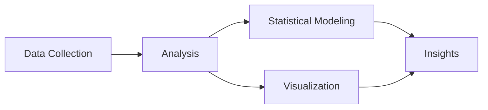

# 📺 Showtime OTT: Predictive Modeling Project

[](https://www.python.org/)
[](https://pandas.pydata.org/)
[](https://matplotlib.org/)
[](https://numpy.org/)

> 🔍 Advanced predictive modeling project analyzing viewer behavior patterns and content performance on Showtime's OTT platform to optimize release strategies and enhance viewership.

<p align="center">
  
</p>

## 🎯 Project Highlights

- **Viewer Analysis**: Comprehensive study of viewing patterns
- **Genre Impact**: Detailed analysis across content categories
- **Temporal Patterns**: Day and seasonal impact analysis
- **Marketing Metrics**: Ad impressions and trailer effectiveness
- **Predictive Insights**: Data-driven release strategies

## 📚 Table of Contents

- [Project Overview](#-project-overview)
- [Key Findings](#-key-findings)
- [Data Analysis](#-data-analysis)
- [Business Recommendations](#-business-recommendations)
- [Technical Components](#-technical-components)
- [Project Structure](#-project-structure)

## 🌟 Project Overview

### 📊 Key Metrics
```python
Analysis_Components = {
    'Visitors': 'Millions per week',
    'Ad_Impressions': 'Campaign performance',
    'Views': ['Trailer', 'Content'],
    'Categories': ['Genre', 'Day', 'Season']
}
```

### 📈 Performance Indicators
```python
Viewing_Metrics = {
    'Content_Views': '0.4-0.5M average',
    'Trailer_Views': '50-200K range',
    'Ad_Impact': 'Variable effectiveness',
    'Correlation': '0.75 trailer-content view'
}
```

## 🎯 Key Findings

### Content Performance
| Metric | Performance | Insight |
|--------|-------------|---------|
| Content Views | 0.4-0.5M avg | Stable viewing patterns |
| Trailer Impact | 0.75 correlation | Strong predictor |
| Ad Impressions | Weak correlation | Limited direct impact |
| Weekend Release | Higher viewership | Optimal timing |

### Genre Analysis
| Genre | Performance | Pattern |
|-------|-------------|---------|
| Action | Highest visitors | Strong performer |
| Romance/Comedy | Similar patterns | Consistent audience |
| Horror/Thriller | Stable numbers | Reliable viewership |

## 🔍 Data Analysis

### Core Variables
- 📊 Platform visitors
- 🎯 Ad impressions
- 🎬 Trailer views
- 👥 Content views
- 📺 Genre classification
- 📅 Release timing
- 🌤️ Seasonal factors

## 💡 Business Recommendations

### Release Strategy
- ✅ Prioritize weekend releases
- ✅ Avoid major sports events
- ✅ Leverage seasonal peaks
- ✅ Optimize genre timing

### Marketing Focus
- 🎯 Enhance trailer campaigns
- 🎯 Target genre-specific audiences
- 🎯 Build pre-release engagement
- 🎯 Optimize ad spending

## 🛠️ Technical Components



## 📁 Project Structure

```
📦 showtime-ott-analysis
 ┣ 📂 data
 ┃ ┗ 📜 viewing_data.csv
 ┣ 📂 analysis
 ┃ ┣ 📜 univariate.py
 ┃ ┣ 📜 bivariate.py
 ┃ ┗ 📜 correlation.py
 ┣ 📂 visualization
 ┃ ┣ 📜 plots.py
 ┃ ┗ 📜 heatmaps.py
 ┣ 📜 README.md
 ┗ 📜 requirements.txt
```

## 📊 Visualizations

<p align="center">
  
  
</p>

## 📞 Contact

Project Link: [https://github.com/yourusername/showtime-ott-analysis](https://github.com/yourusername/showtime-ott-analysis)

---
<p align="center">
  Developed by Data Science and Business Analytics Team (DSBA)
  <br>
  © 2024 Showtime OTT Analytics Project
</p>
